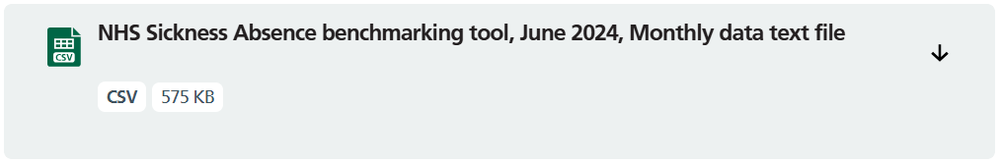
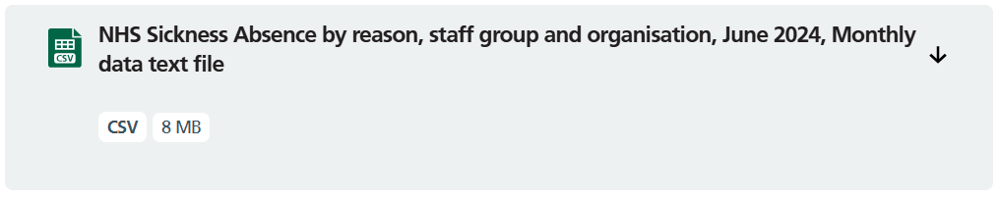

# Workforce Sickness

This git repository contains code to process workforce sickness data using the [NHSD Sickness and Absence dataset]([https://digital.nhs.uk/data-and-information/publications/statistical/nhs-sickness-absence-rates]). The code performs a basic ETL process on the data available and uploads the data to the NCL data warehouse.

## ChangeLog

### [1.0.0] - 13/11/2024

- Core functionality.
- Relies on the source data being manually downloaded and saved in the data/current directory.

### [1.1.0] - 15/11/2024

- Added ability to download source data through data scraping
- Code works by downloading the last "n" releases for a given publication

#### [1.1.1] - 21/11/2024

- Updated documentation for clarity

## First Time Installation

Follow the NCL scripting onboarding document, Section 4.1 (this describes the process for a new project but is also applicable for cloning an existing project) for guidance on installing python, and setting up a virtual environment.
The onboarding document can be found [here](https://nhs-my.sharepoint.com/:w:/r/personal/emily_baldwin20_nhs_net/Documents/Documents/Infrastructure/Skills%20Development/Onboarding%20resources/Scripting_Onboarding.docx?web=1):

Copy the .env into the WF_SICKNESS folder of this project. The .env file can be found at: 
`N:\Performance&Transformation\Performance\NELCSUNCLMTFS\_DATA\UEC and Productivity Team\Workforce\Code Resources\wf_sickness`

## Usage

There are two datasets maintained using this project:
* Sickness - Overall sickness data using the "Benchmarking" data from NHSD. The benchmarking files on NHSD have the naming convention: `NHS Sickness Absence benchmarking tool, MONTH YEAR, Monthly data text file`

* By Reason - Sickness data split by reason for absence using "By Reason" data from NHSD. The By Reason files on NHSD have the naming convention: `NHS Sickness Absence by reason, staff group and organisation, MONTH YEAR, Monthly data text file`

**BY DEFAULT SOURCE_SCRAPE WILL BE ENABLED**

**If SOURCE_SCRAPE is NOT enabled** in the .env file:
Ahead of running the code, download the files containing the new data and save them to the data/current directory in this repo. The code detects what type of data is in the file from the filename using the assumption that the By Reason data has "reason" in the filename. If the file is renamed, make sure the Benchmark data files do not have "reason" in the filename and the By Reason data files do.

**If SOURCE_SCRAPE is enabled** in the .env file the source data will be downloaded when the code is executed. You need to configure SOURCE_SCRAP_MODE to specify which files you want to download. This is outlines fully in the **User Settings** section of the README.

After this is done the process for executing the code is:
* Open the project directory.
  * Open VS Code.
  * Open a new folder (Ctrl+K Ctrl+O) and select the wf_sickness folder .
* Enable the virtual environment (see the onboarding document linked in the First Time Installation section).
* Execute the src/wf_sickness.py file either by opening the src/wf_sickness.py file in VSCode and using the Run arrow button in the top right of the window.
* While executing, the code will print the progress of the code in the terminal by listing the file currently being processed.
* If SOURCE_ARCHIVE is enabled, the code will move the source data to the archive directory (specified in the config.toml) after being processed. If the archive file already contains a file sharing the name of the source file, the user will be prompted in a pop-up window how they want to handle the conflict.

## User Settings
The .env file in the project folder (if missing, refer to the First Time Installation section) contains a list of user settings that affect how the code is executed.
* SOURCE_SCRAPE: When True, the code will download the data from NHSD
* SOURCE_SCRAPE_MODE: Determines how the data scraping will select which files to download. There are 2 main modes:
  * "Latest n": By setting the mode variable to this you can specify the code to download and process the last n months of data (i.e. "Latest 3" will download the last 3 months of data). You can set this to "Latest" to download only the most recent data.
  * (NOT YET IMPLEMENTED) "UI": During the code execution, the user will be prompted to select files to process.
* SOURCE_CLEANSE: When set to True, the code will rename the source data files to a standardised format.
* SOURCE_ARCHIVE: When set to True, the code will move source files from the current folder to the archive folder after the data is processed.
* OVERWRITE_WARNING: When set to True, the code will warn the user when attempting to archive a source file that already exists in the archive file and prompt the user on how to handle it.
* OVERWRITE_DEFAULT: When OVERWRITE_WARNING is set to False, instead of prompting the user when an conflict is detected, the code will use this value as the default behaviour for deciding whether to overwrite during conflicts.
* SQL_ADDRESS: The address of the NCL data warehouse. Included in the .env file to prevent the address from being visible on github.

## Licence
This repository is dual licensed under the [Open Government v3]([https://www.nationalarchives.gov.uk/doc/open-government-licence/version/3/) & MIT. All code can outputs are subject to Crown Copyright.

## Contact
Jake Kealey - jake.kealey@nhs.net

Project Link: https://github.com/ncl-icb-analytics/wf_sickness

*The code for data scraping was largely lifted from existing scripts by eddie.davison@nhs.net*
